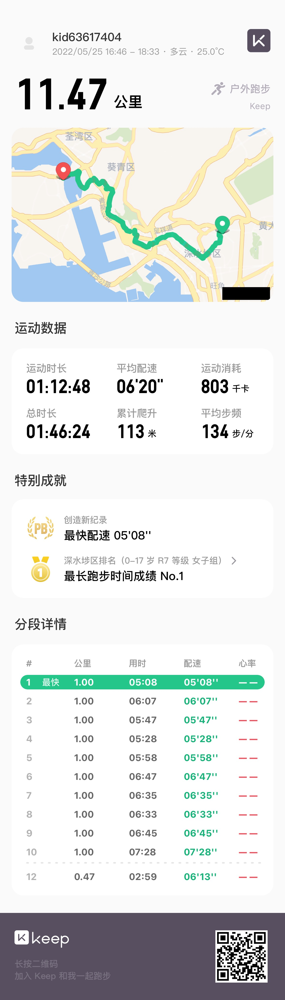
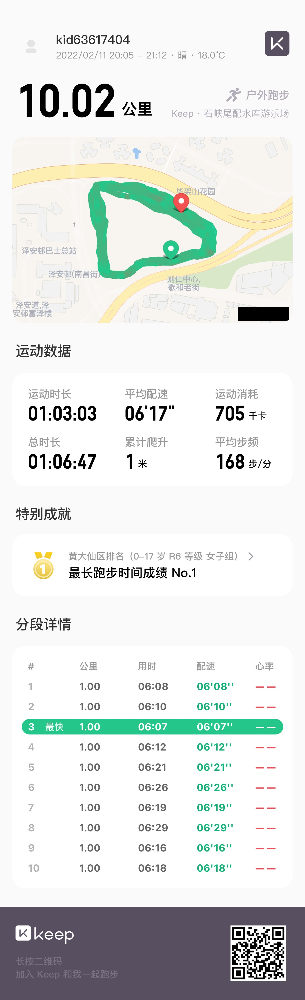

<!-- ```python
import libr
print('hello')
``` -->
<!-- 

 -->
  <!-- < img src="running1.jpg" alt="image1">
  < img src="running2.jpg" alt="image2">
  < img src="running3.jpg" alt="image2"> -->

<!-- 
  
  
  
 -->



<!--  -->